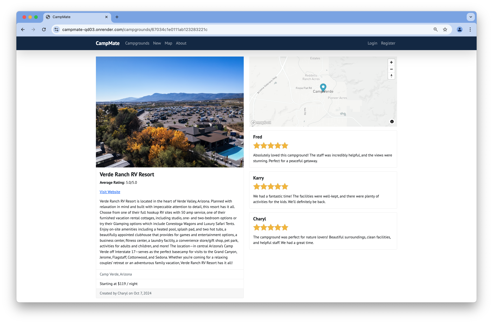

# CampMate

### [Click to Visit CampMate](https://campmate-qd03.onrender.com)

CampMate is a full-stack web application where users can create, review, and manage campgrounds. This project allows users to browse all campgrounds and read reviews without signing up. However, in order to review or create a campground, users need to create an account and log in.

## Functionalities

-   **View Campgrounds and Reviews**:
    -   All users, including non-registered users, can browse the list of campgrounds, view details, and read reviews from other users.
-   **User Authentication**:
    -   Users can sign up, log in, and log out. User authentication and session management are handled securely using **Passport.js**.
-   **Create, Edit, and Delete Campgrounds**:

    -   Logged-in users can create new campgrounds. Users can edit or delete only the campgrounds they created. Each campground includes a title, location, description, price, images, and a location displayed on an interactive map using **Mapbox**.

-   **Leave, and Delete Reviews**:

    -   Logged-in users can leave reviews on campgrounds, as well as delete their own reviews. Each review includes a rating (1-5) and a text body.

-   **Persistent Data Storage**:

    -   All campgrounds, reviews, and user information are stored in **MongoDB Atlas**, ensuring that data is preserved across sessions and accessible from anywhere.

-   **Map Integration**:

    -   Interactive maps are integrated into the application using **Mapbox**, allowing users to see campground locations visually on a map, making it easier to explore nearby campgrounds.

-   **Flash Messages**:

    -   Flash messages are used throughout the application to provide feedback to users (e.g., success messages after creating a campground, error messages if something goes wrong).

-   **Responsive Design**:
    -   The website is fully responsive, ensuring a seamless experience on both desktop and mobile devices. The design is powered by **Bootstrap** for responsive layouts and styling.

## Technologies Used

### Front-End

-   **HTML5**:

    -   Provides the structure and content of the website.

-   **CSS3**:

    -   Used for styling and layout of web pages.

-   **Bootstrap**:

    -   A popular front-end framework used for building responsive, mobile-first designs.

-   **JavaScript (jQuery)**:

    -   Handles dynamic content, interactivity, and DOM manipulation for a smooth user experience.

### Back-End

-   **Node.js**:

    -   JavaScript runtime used for executing server-side code.

-   **Express.js**:

    -   A web application framework for Node.js, used to build the back-end logic and define routes.

-   **MongoDB Atlas**:

    -   A cloud-based NoSQL database used for storing campground, user, and review data. Hosted on AWS for high availability and scalability.

-   **Passport.js**:

    -   Middleware used for authentication, enabling users to register, log in, and manage sessions.

-   **EJS (Embedded JavaScript)**:

    -   Templating engine used for rendering dynamic HTML pages on the server-side.

### API & Other Integrations

-   **Mapbox API**:

    -   Used to display interactive maps for campground locations, giving users a visual understanding of where the campgrounds are located.

-   **Cloudinary**:

    -   A cloud-based image hosting service used to store and manage campground images.

-   **AWS (Amazon Web Services)**:

    -   MongoDB Atlas is hosted on **AWS EC2** instances to ensure secure and reliable database hosting.

-   **RESTful API**:

    -   The app uses RESTful routing to manage CRUD operations for campgrounds and reviews, allowing users to interact with resources through standardized HTTP methods.

## Project Structure

-   **Views**:

    -   All user interfaces are rendered using **EJS** templates. The templates are dynamic and fetch data from the back-end to display the campgrounds, reviews, and user information.

-   **Routes**:

    -   The app follows RESTful routing conventions. Different routes are defined for campgrounds, users, and reviews:
        -   `/campgrounds`: Handles displaying all campgrounds, creating new campgrounds, and managing individual campground details.
        -   `/campgrounds/:id`: Handles viewing, editing, and deleting a specific campground.
        -   `/campgrounds/:id/reviews`: Handles adding, editing, and deleting reviews for a specific campground.
        -   `/users`: Handles user registration and login/logout functionality.

-   **Controllers**:

    -   All the logic for handling requests, database queries, and rendering views is organized into **controller** files. Each major resource (campgrounds, reviews, users) has its own controller.

-   **Models**:
    -   **MongoDB models** define the schema for the campground, user, and review data. These models ensure that the data is properly structured before being stored in the database.

## Environment Variables

The application uses environment variables to manage sensitive information such as the **Mapbox API token** and the **MongoDB Atlas connection string**. These environment variables are defined in a `.env` file and are accessed using `process.env` in the code.

Example `.env` file:

```bash
CLOUDINARY_CLOUD_NAME=<Your Cloudinary Cloud Name>
CLOUDINARY_KEY=<Your Cloudinary API Key>
CLOUDINARY_SECRET=<Your Cloudinary API Secret>
MAPBOX_TOKEN=<Your Mapbox API Token>
DB_URL=<Your MongoDB Atlas Connection String>
```

## Visual Overview

Below are key sections of the CampMate application showcasing various functionalities:

1. **Campgrounds List**  
   

2. **Campground Details**  
   

3. **Interactive Map**  
   

4. **User Registration Page**  
   
